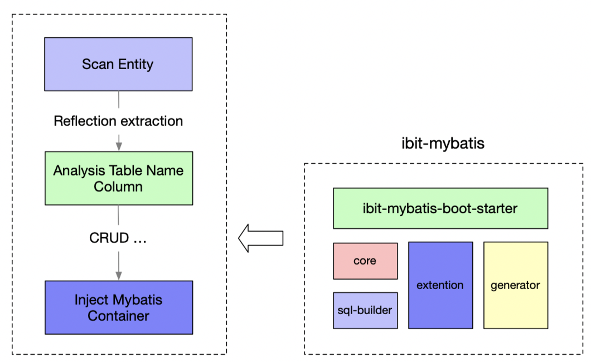
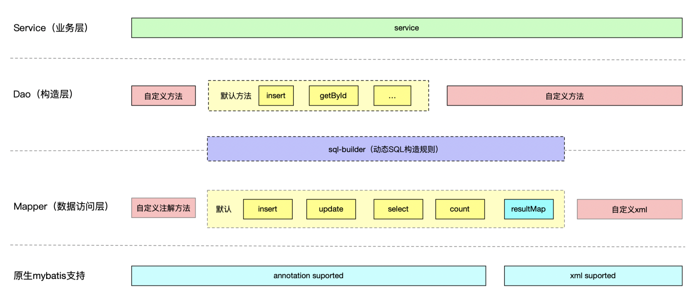
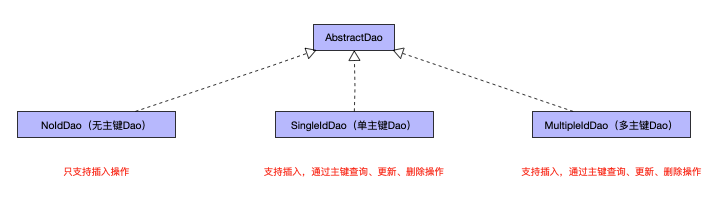

# ibit-mybatis

## 概述

&nbsp;&nbsp; ibit-mybatis是一个Mybatis的增强工具，在Mybatis的基础上增加了新的特性与功能，志在简化开发流程、提高开发效率。</br>

### 特性

* 无侵入，引入”ibit-mybatis”对现有工程不会产生影响。
* 灵活的CRUD（增、删、改、查）操作，内置Dao，Mapper，支持常用的单表CRUD操作，更有强大的SQL构造器（[sql-builder](https://github.com/ibit-tech/sql-builder)），满足更为复杂的操作（如聚合函数、分组、连表）。
* 内置代码生成器（[ibit-mybatis-generator](https://github.com/ibit-tech/ibit-mybatis-generator)），指定数据库表，自动生成Dao、Mapper、Entity、Properties等基础类，减少重复或者相似代码编写。
* 扩展支持，分页、数据脱敏
* 主流微服务框架springboot（[ibit-mybatis-springboot-starter](https://github.com/ibit-tech/ibit-mybatis-springboot-starter)）的支持

### 整体框架图



### sql-builder描述

`sql-builder`定义动态SQL的生成规则，用来实现单表的CRUD操作。

#### 模块图


#### 动态SQL构造规则

| 序号 | 方法 | 描述 |
| -- | -- | -- |
| 1 | rawSelect </br> selectPo（对象）</br> selectDistinct </br> selectDistinctPo（对象）| `rawSelect [distinct]`语句 |
| 2	 | count </br> countDistinct | `rawSelect count [distinct]`语句 |
| 3 | deleteFrom </br> deleteTableFrom（别名）| `delete from`语句 |
| 4	 | rawUpdate | `rawUpdate`语句 |
| 5 | insertInto </br> batchInsertInto（批量）| `insert into`语句 |
| 6 | set </br> increaseSet（列自增）</br> decreaseSet（列自减）</br> |`set`语句 |
| 7 | values | `values`语句 |
| 8 | from | `from`语句 |
| 9 | joinOn </br> leftJoinOn </br> rightJoinOn </br> fullJoinOn </br> innerJoinOn </br>complexLeftJoinOn </br> complexRightJoinOn </br> complexFullJoinOn </br> complexInnerJoinOn | `[left\|right\|full\|inner] join on`语句 |
| 10 | where </br> andWhere </br> orWhere | `where`语句 |
| 11 | groupBy | `group by`语句 |
| 12 | having </br> andHaving </br> orHaving | `having`语句 |
| 13 | orderBy | `order by`语句 |
| 14 | limit | `limit`语句 |

更加详细用法参考[sql-builder](https://github.com/ibit-tech/sql-builder)。

### 核心代码说明

  ibit-mybatis重新定义了业务分层模型，将原有的Dao层下放到Mapper（数据访问层），增加新的Dao层（构造层）。
  
#### 分层模型

   
 
#### 定义Mapper

Mapper为数据访问层，默认基于注解实现了insert（增加），rawUpdate（更新/删除），rawSelect（查询），count（计数）和实体映射到xml的ResultMap。接收参数为`sql-builder`生成的SqlParams参数。Mapper对于原生的基于xml、注解的数据访问方式是兼容的。 

#### 定义Dao

Dao为构造层，可以通过`sql-builder`构造sql，调用Mapper获取结果。定义通用的Dao模板，默认支持跟主键相关的CRUD操作。</br>
Dao模板设计，按照主键个数分类，分成3类，无主键、单个主键、多个主键。

* NoIdDao：无主键Dao，只支持插入操作。
* SingleIdDao：单个主键Dao，支持插入，通过主键查询、更新删除操作。
* MultipleIdDao：多个主键Dao，支持插入，通过主键查询、更新删除操作。



## 用法

### 相关引用

#### Gradle

```
compile 'tech.ibit:ibit-mybatis:${lastest}'
```

#### Maven

```
<dependency>
  <groupId>tech.ibit</groupId>
  <artifactId>ibit-mybatis</artifactId>
  <version>${latest}</version>
</dependency>
```

**说明**: 将 "${latest}" 替换成对应的版本

### 其他说明

如果需要需要在Mapper中动态指定"resultMap",则需要增加拦截器`tech.ibit.mybatis.plugin.ResultMapInterceptor`

```
@Bean
public ResultMapInterceptor getResultMapInterceptor() {
    return new ResultMapInterceptor();
}
```

## 更新说明

### 1.1 更新内容

 * 支持通用枚举类型（CommonEnum，枚举-Integer转换）
 * 如果需要自定义的枚举类型，则
 
### 增加类

```

/**
 * 定义通用枚举类
 */ 
public interface CommonEnum {

    /**
     * 获取枚举值
     *
     * @return 枚举值
     */
    int getValue();
    
    // 省略其他方法
}

/**
 * 通用枚举类处理器
 */
public class CommonEnumTypeHandler<E extends CommonEnum> extends BaseTypeHandler<E> {
   // 省略方法
}

```

### 用法

#### mapper中，字段增加handler

```
<result column="type" jdbcType="INTEGER" property="type"
          typeHandler="tech.ibit.mybatis.type.CommonEnumTypeHandler"/>
```

#### SqlBuilder，定义类型转换

```
// 测试设置枚举类型
SqlBuilder.setValueFormatter(new LinkedHashMap<Class, Function<Object, Object>>() {{
    put(tech.ibit.mybatis.type.CommonEnum.class, o -> ((tech.ibit.mybatis.type.CommonEnum) o).getValue());
}});
```


